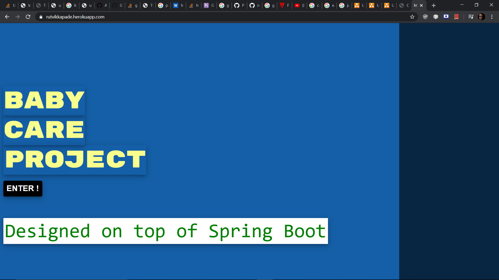
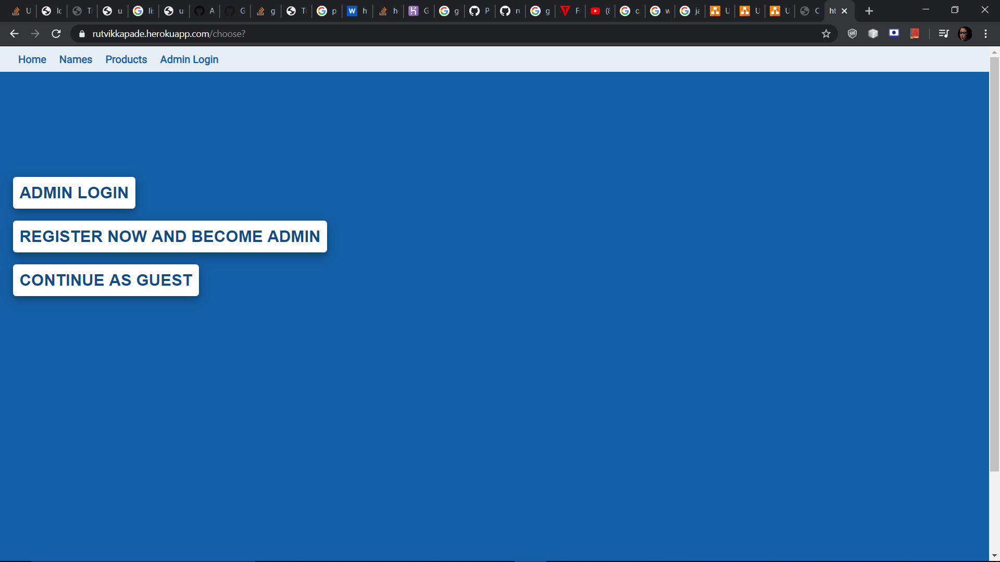
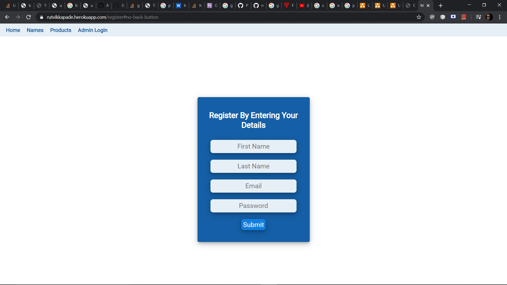
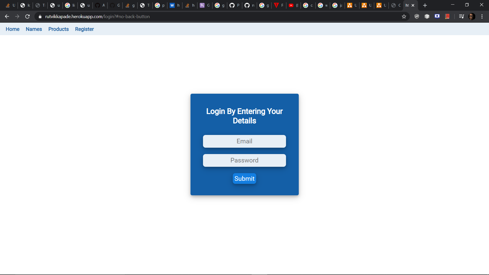
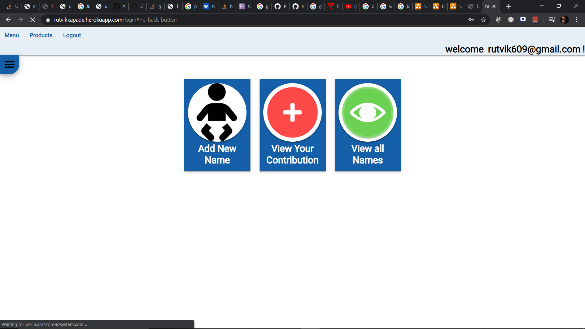
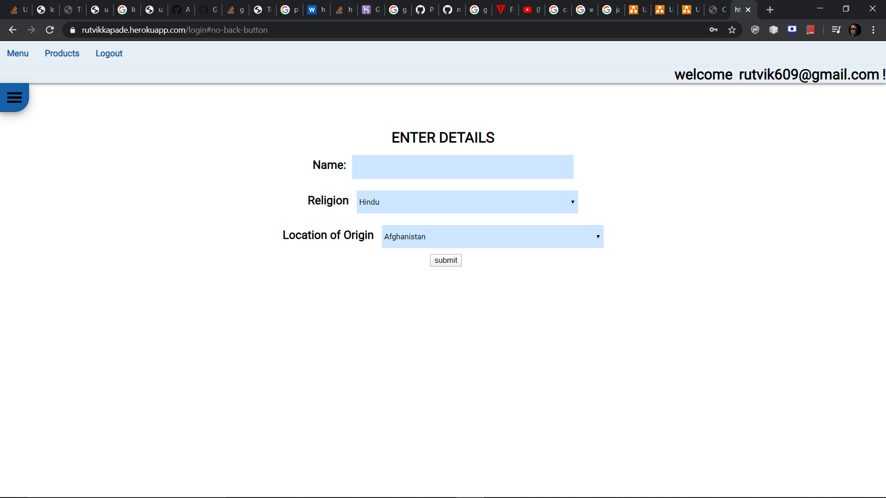
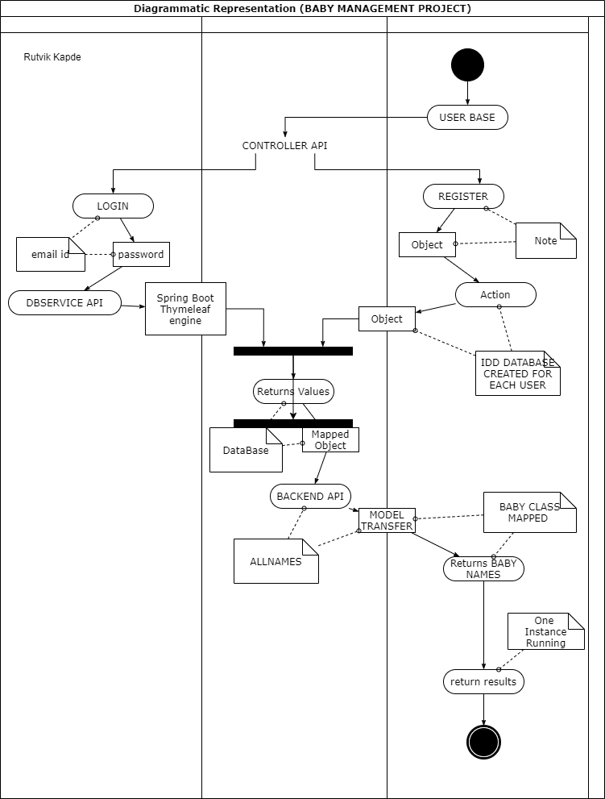
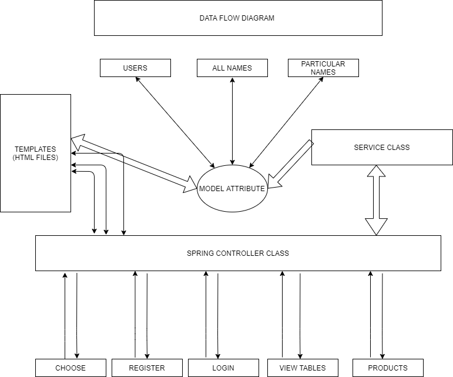

# BabyCareProject

Baby Care Project :

SOME KEY POINTS ABOUT SPRING BOOT :

Spring Boot is an open source Java-based framework used to create a micro Service. It is developed by Pivotal Team and is used to build stand-alone and production ready spring applications. This chapter will give you an introduction to Spring Boot and familiarizes you with its basic concepts.

What is Micro Service?
Micro Service is an architecture that allows the developers to develop and deploy services independently. Each service running has its own process and this achieves the lightweight model to support business applications.

Advantages
Micro services offers the following advantages to its developers −

Easy deployment
Simple scalability
Compatible with Containers
Minimum configuration
Lesser production time
What is Spring Boot?
Spring Boot provides a good platform for Java developers to develop a stand-alone and production-grade spring application that you can just run. You can get started with minimum configurations without the need for an entire Spring configuration setup.

Advantages
Spring Boot offers the following advantages to its developers −

Easy to understand and develop spring applications
Increases productivity
Reduces the development time
Goals
Spring Boot is designed with the following goals −

To avoid complex XML configuration in Spring
To develop a production ready Spring applications in an easier way
To reduce the development time and run the application independently
Offer an easier way of getting started with the application
Why Spring Boot?
You can choose Spring Boot because of the features and benefits it offers as given here −

It provides a flexible way to configure Java Beans, XML configurations, and Database Transactions.

It provides a powerful batch processing and manages REST endpoints.

In Spring Boot, everything is auto configured; no manual configurations are needed.

It offers annotation-based spring application

Eases dependency management

It includes Embedded Servlet Container

How does it work?
Spring Boot automatically configures your application based on the dependencies you have added to the project by using @EnableAutoConfiguration annotation. For example, if MySQL database is on your classpath, but you have not configured any database connection, then Spring Boot auto-configures an in-memory database.

The entry point of the spring boot application is the class contains @SpringBootApplication annotation and the main method.

Spring Boot automatically scans all the components included in the project by using @ComponentScan annotation.

Spring Boot Starters
Handling dependency management is a difficult task for big projects. Spring Boot resolves this problem by providing a set of dependencies for developers convenience.

For example, if you want to use Spring and JPA for database access, it is sufficient if you include spring-boot-starter-data-jpa dependency in your project.
Note that all Spring Boot starters follow the same naming pattern spring-boot-starter- *, where * indicates that it is a type of the application .

APPLICATION OVERVIEW 

HOME PAGE
 
NAVIGATION PAGE
  
REGISTRATION PAGE ADMIN
 
LOGIN PAGE

USER LOGGED IN PAGE

ADD NEW BABY NAME 

USER CONTRIBUTION PAGE
 
DATA FLOW DIAGRAM
 
UML DIAGRAM
 
